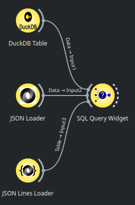
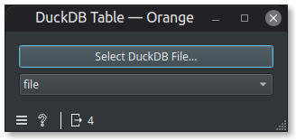
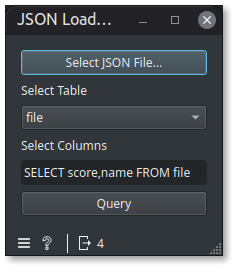
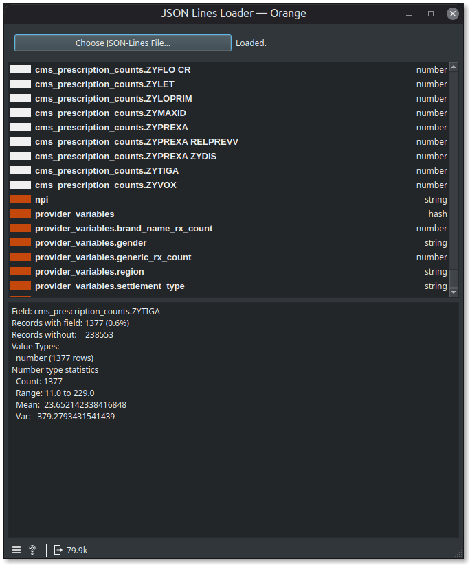
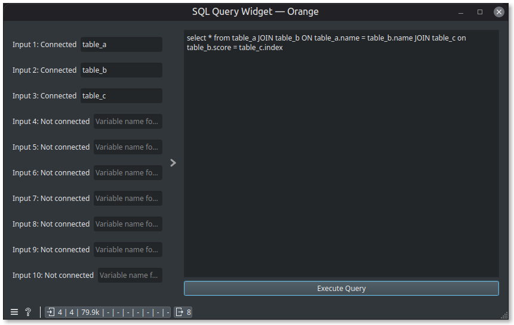

# Orange3-SQLQuery

This allows use DuckDB to perform SQL queries on multiple input tables from duckdb, json, json line (jsonl) files, and anything else that DuckDB supports.

## Installation

Within the Add-ons installer, click on "Add more..." and type in orange3-sqlquery

## Provided Widgets

This addon provides 4 widgets

#### DuckDB Table

#### JSON Loader

#### JSON Lines Loader (and description)

#### SQL Query Widget

### Example Workflow

* [The Rainfall of Iranian Cities dataset](https://www.kaggle.com/datasets/mohammadrahdanmofrad/average-monthly-precipitation-of-iranian-cities)
* [Iranian City Locations](https://github.com/chrislee35/orange3-sqlquery/blob/main/datasets/iranian_city_locations.csv?raw=true)

